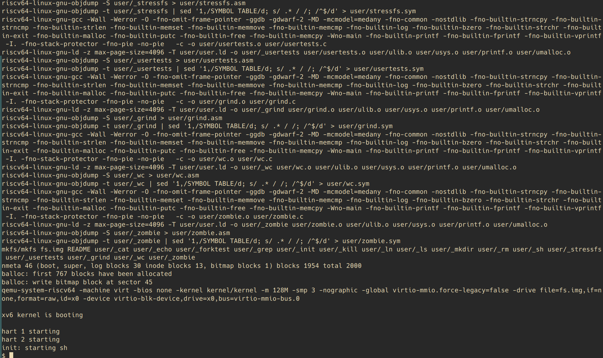
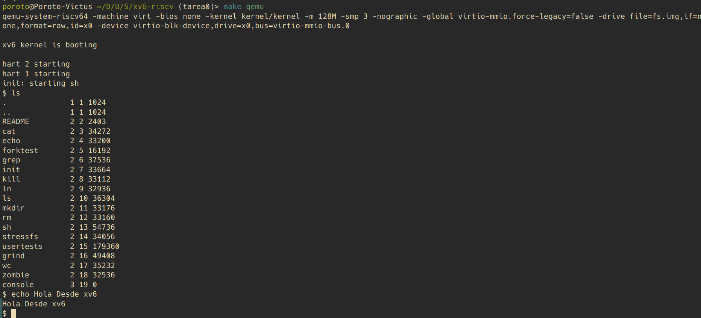

# Informe
## Instalación

Ya que uso ubuntu, todo fue ejecutado directamente en mi maquina y no en una vm.
Inicialmente trate de instalar qemu localmente y hacer el build para riscv64 como sale en su página oficial pero no me resultó.
Termine instalandolo directamente desde apt con `sudo apt install qemu-system`.

Luego hice un fork del repositorio, lo clone y corrí `make qemu` dentro de el. El resultado fue el siguiente:

## Capturas

