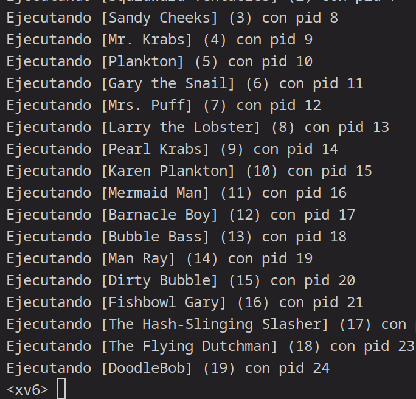
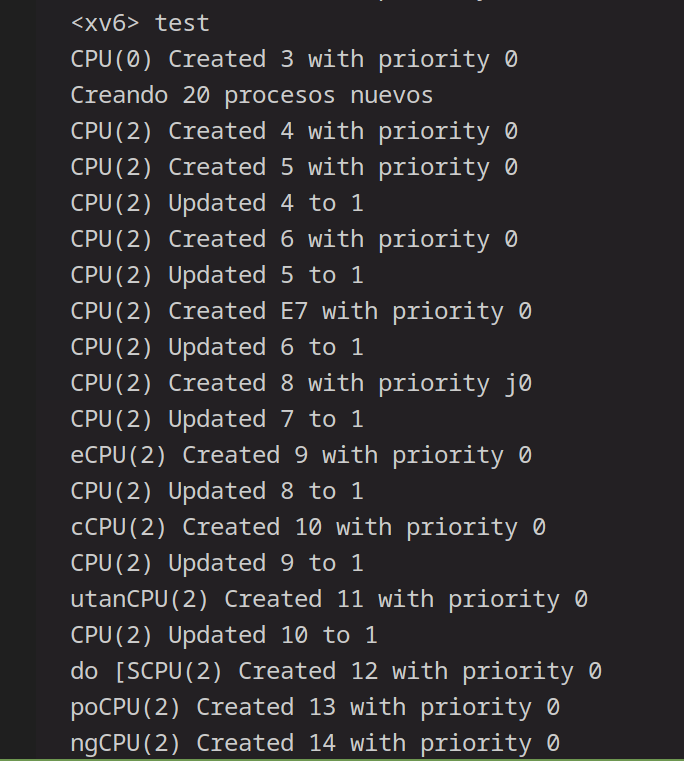
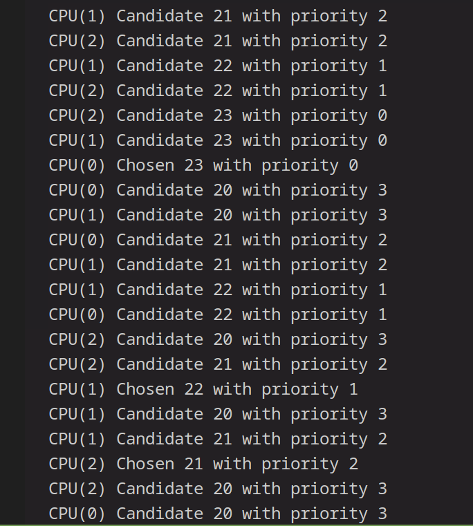

# Entrega del Proyecto de Modificación de xv6

## Funcionamiento y Lógica del Sistema de Prioridades

Originalmente el Scheduler de xv6 corría el primer programa que encontraba en la tabla de procesos, lo que podía ser ineficiente o poco justo, con esta modificación se le añadió un sistema de prioridades que permite que los procesos que llegaron primero sean los primeros en correr y no dependan de su ubicación en la tabla, haciendo la ejecución más justa.

1. **Creación de un nuevo proceso**: 
	Cada nuevo proceso se crea con una prioridad de 0 y un boost de 1. 
2. **Ajuste de prioridad**:
	Luego de crearlo, al resto de los procesos se les ajusta la prioridad sumándole el boost. si su prioridad es mayor a 9, se le asigna un boost de -1 y si es de 0 o menos se le vuelve a asignar un boost de 1
3. **Ejecución**:
	Al momento de ejecutar un proceso, el scheduler busca el proceso con menor prioridad entre todos y lo ejecuta.

## Explicación de las Modificaciones Realizadas

1. **Estructura del Proceso**:
   - Se añadieron dos nuevos campos a la estructura del proceso: `priority` y `boost`.
   - `priority`: Almacena la prioridad del proceso.
   - `boost`: Determina la dirección del cambio en la prioridad.

2. **Función `allocproc()`**:
   - Al crear un nuevo proceso, se inicializan `priority` y `boost`.
   - Se ajustan las prioridades de los demás procesos en el sistema, excluyendo el proceso recién creado.

3. **Función `scheduler()`**:
   - Se modificó el algoritmo de planificación para priorizar los procesos según su valor de `priority` buscando el con mejor prioridad y ejecutándolo antes del resto.

4. **Programa de Prueba**:
   - Se creó un programa que genera múltiples procesos hijos y verifica que las prioridades se ajusten correctamente durante la ejecución.
   - 

## Dificultades Encontradas y Soluciones Implementadas

1. **Condiciones de Carrera**:
   - Al modificar las prioridades de los procesos, cambiaban erraticamente. 
   - **Solución**: Se usaron locks al acceder a la estructura de procesos, asegurando que solo un CPU pueda modificar los valores de prioridad a la vez.

2. **Prioridades**:
   - Era difícil saber si estaba funcionado asignando correctamente las prioridades
   - **Solución**: Se agregaron `printf()` a la asignacion para ver que se estuvieran actualizando correctamente.
   - 

3. **Orden de ejecución**:
   - No sabia si se estaba ejecutando en el orden correcto
   - **Solución**: Se agregaron `printf()` al scheduler  para ver que se estuvieran eligiendo los procesos correctamente.
   - 
